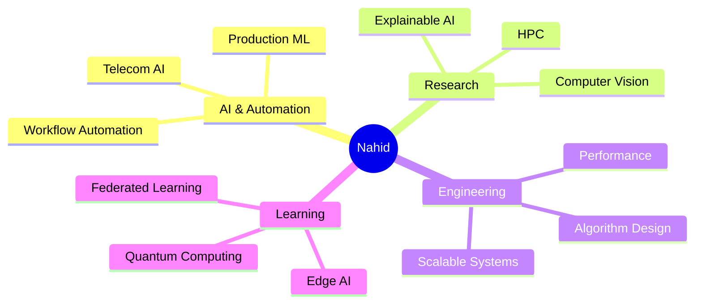

<div align="center">


<h3>
   Hi there, I'm Nahid!
</h3>

<a href="https://git.io/typing-svg">
  
</a>

<br/>


</div>

---

<div align="center">

### 🌐 Connect With Me

<a href="https://linkedin.com/in/nahid-hasan-ashik/"></a>
<a href="https://github.com/nahidhashik"></a>
<a href="https://researchgate.net/profile/Nahid-Ashik"></a>
<a href="https://medium.com/@nahidhashik"></a>
<a href="https://x.com/nahidhashik"></a>
<a href="https://facebook.com/nahidhashik"></a>
<a href="mailto:nahidhashik@gmail.com"></a>
<a href="https://wa.me/8801728092066"></a>

</div>

---

## 🧠 About Me

```yaml
name:        Nahid Hasan Ashik
role:        AI & Automation Specialist @ SARBS Communication Ltd.
education:   B.Sc. in CSE — East West University
co-founder:  Lastcoders Limited
research:    Explainable AI (XAI) & Computer Vision
languages:   [ Bangla, English, Hindi, Urdu ]
currently:   Advancing scientific discovery through algorithm design
            & interdisciplinary collaboration.
```

- ⚡ **High-Performance Computing (HPC)** & parallel system design
- 🤖 **Artificial Intelligence & Machine Learning** in production environments
- 🧬 **Quantum Computing** explorations and research
- 📊 **Performance Optimization** for scalable, real-world systems
- 🌱 Always learning — currently exploring edge AI and federated learning

> 💡 *"Code is the bridge between what we imagine and what we can prove."*

---

## 🛠️ Tech Stack

<div align="center">

#### 💻 Languages


#### 🤖 AI / ML / Data


#### 🌐 Web & Frameworks


#### 🔧 Tools & DevOps


</div>

---

## 🔬 Research Publications

<table>
<tr>
<td width="50">📄</td>
<td><b>Deep Learning-Based Skin Lesion Classification using CNN</b><br/>
<sub>📰 <i>International Journal of Innovative Science and Research Technology (IJISRT)</i> · April 2025</sub></td>
</tr>
<tr>
<td>📄</td>
<td><b>Automation of Drowsiness Alert System for Drivers</b><br/>
<sub>📰 <i>ICRTMDR-23, IFERP — Istanbul, Turkey</i> · November 2023</sub></td>
</tr>
<tr>
<td>📄</td>
<td><b>A Hybrid Approach for Plant Disease Detection using CNN & SVM</b><br/>
<sub>📰 <i>International Journal of Innovative Science and Research Technology (IJISRT)</i> · October 2023</sub></td>
</tr>
</table>

---

## 🏆 Competitive Programming

<div align="center">

<table>
<tr>
<td width="50%" align="center" valign="top">
<h3>🐝 beecrowd</h3>

<a href="https://www.beecrowd.com.br/judge/en/profile/203779">
  
</a>

<br/><br/>


<br/>


<br/>


<br/>


<br/><br/>

<sub><b>100+ Problems Solved · ~55% Acceptance Rate</b></sub>
</td>
<td width="50%" align="center" valign="top">
<h3>🧩 LeetCode</h3>
<a href="https://leetcode.com/nahidhashik">
  
</a>
<br/>
<sub><b>Active Problem Solver</b></sub>
</td>
</tr>
</table>

</div>

---

## 📊 GitHub Analytics

<div align="center">


<br/>


</div>

---

## 🎖️ Milestones & Achievements

<div align="center">


<br/>


<br/><br/>

### 🛠️ Skill Stack at a Glance


</div>

---

## 🎯 Current Focus



---

<div align="center">

### 💬 Let's Build Something Amazing Together

📫 Reach me at **nahidhashik@gmail.com** • Open to research collaborations, AI consulting, and meaningful conversations.


<sub>⭐ <i>From <a href="https://github.com/nahidhashik">Nahid Hasan Ashik</a> — with curiosity and caffeine.</i></sub>

</div>
